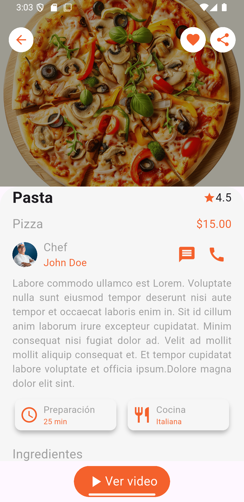

# RecipesApp

## Funcionalidades Principales  
- **Búsqueda de Recetas:** Encuentra recetas rápidamente con el buscador integrado.
- **Categorías de Comida:** Explora recetas organizadas por diferentes categorías culinarias.
- **Listado de Chefs:** Descubre chefs destacados y sus recetas exclusivas.
- **Detalles de Recetas:** Consulta ingredientes, preparación y tiempos de cocción.
- **Favoritos:** Guarda tus recetas preferidas para acceder a ellas fácilmente.

## Funcionalidades Por agregar
- **Valoraciones y Comentarios:** Deja tu opinión y revisa las reseñas de otros usuarios.

## Sreen de pantallas



## QR DE LA COMUNIDAD FLUTTER PIURA  


## Para colaborar
- **Cree su propia rama** Crea tu propia rama y realiza cambios en ella.
- **Haga un pull request** Solicita cambios y espera la aprobación.

## Instalación  
1. Clona el repositorio:  
   ```bash
   git clone https://github.com/Flutter-Piura/recipes_app.git
   ```

2. Navega al directorio del proyecto:
   ```bash
   cd RecipesApp
   ```

3. Instala dependencias
   ```bash
   flutter pub get
   ```

4. Ejecuta la aplicación en un dispositivo físico o emulador:
   ```bash
   flutter run
   ```

